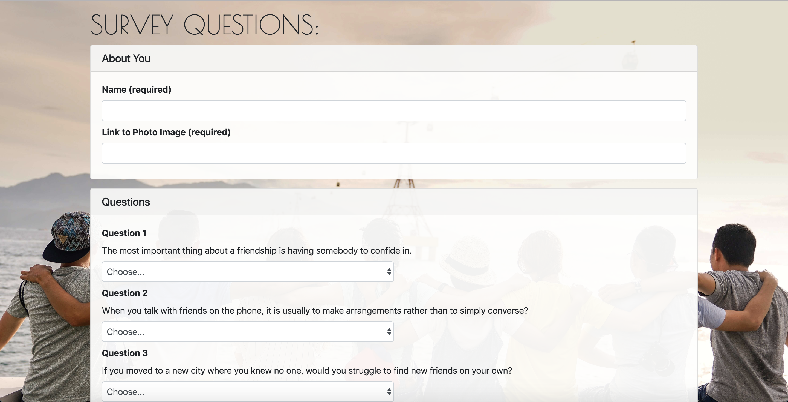
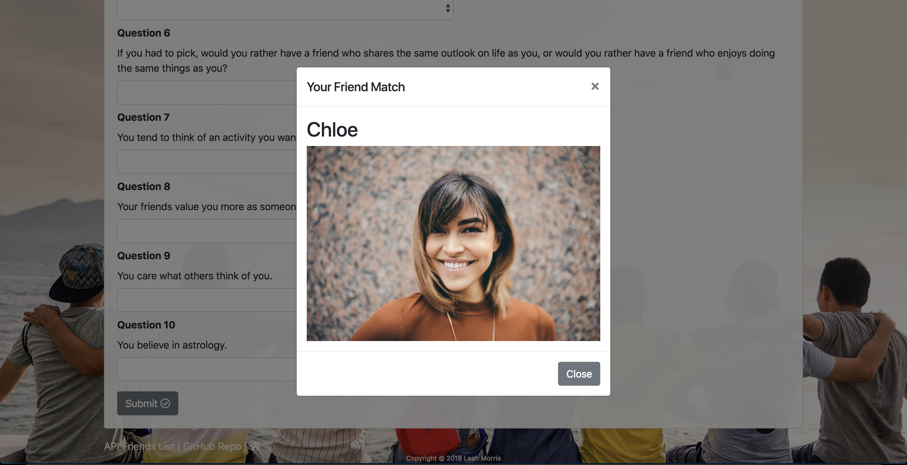

# Friend-Finder
A full-stack compatibility-based "FriendFinder" application utilizing Express to handle routing.  
Find your new BFF based on a couple fun questions <a href="https://friendfinder-chicago.herokuapp.com/">here</a> (deployed to Heroku)!

## Pages
Landing (Home) Page

Survey Page

BFF Match Modal View

## Deployment
This app is deployed using Heroku.  Take the quick survey <a href="https://friendfinder-chicago.herokuapp.com/">here</a> to find your new BFF! 

## Tools/Technologies Used
<a href="https://getbootstrap.com/">Bootstrap</a> 
<a href="https://fontawesome.com/">Font Awesome</a> 
<a href="https://fonts.google.com/">Google Fonts</a> 
<a href="https://jquery.com/">jQuery</a> 
<a href="https://nodejs.org/en/">Node.js</a> 
<a href="https://www.npmjs.com/package/express">Express.js</a> 
<a href="https://www.npmjs.com/package/path">Path</a>

